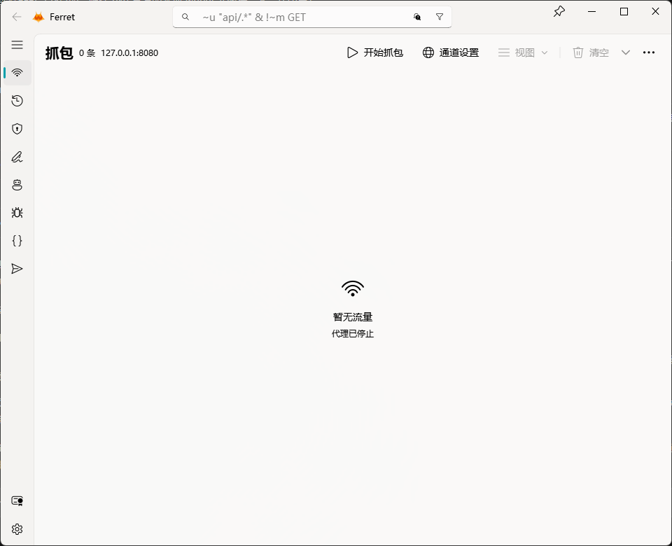

# Ferret

基于 [mitmproxy](https://mitmproxy.org) 内核的 Windows 桌面抓包工具，用
PySide6 + QFluentWidgets 提供图形界面：HTTPS 解密、拦截改写、Mock 重放，
本机与局域网设备都能接入，开箱即用。



## 功能特性

- **五种抓包通道自由组合**：常规代理、进程抓包（local，免配置代理直接抓指定进程）、
  WireGuard（手机等设备扫码导入配置接入）、反向代理、SOCKS5 入站；任意组合并存，
  运行中热切换，无需重启。
- **一键系统代理**：开始时自动挂载 Windows 系统代理，停止时整体回落。
- **HTTPS 解密与证书管理**：一键生成 CA、装入系统信任库、导出 PEM；
  内置证书下载端点，手机等局域网设备可直接获取证书。
- **拦截与断点修改**：请求 / 响应两个阶段可暂停流量，改完放行。
- **统一重写引擎**：修改头 / 体、URL 重定向、本地文件映射、整包替换请求或响应，
  一个规则列表，行序即执行序。
- **Mock 服务端重放**：把抓到的响应一键加入响应池，命中相同请求直接回放，无需真源站。
- **WebSocket 与 SSE**：WebSocket 逐帧展示；SSE 事件随推送实时进表
  （自研 tee 通道，mitmproxy 原生不支持）。
- **上游代理与认证**：出口可挂上游 HTTP(S) 代理（含凭证）；代理入站支持单用户认证。
- **流量管理**：过滤搜索、备注、屏蔽主机、Compose 手工构造请求、Python 脚本扩展。
- **导入导出**：HAR / curl / httpie / raw 导出，.flow 保存与读入重放。

## 安装

### 安装包（推荐）

到 [Releases](https://github.com/JunctureHao/ferret/releases) 下载最新版 Windows
安装包（x64）。

### 从源码运行

需要 [uv](https://docs.astral.sh/uv/)（Python 版本由 `pyproject.toml` 锁定为 3.12.13）：

```sh
uv run ferret
```

## 快速开始

1. 启动后在「抓包」页选择通道（默认常规代理，端口 8080），点「开始」。
2. 到「证书」页安装 CA 证书：本机一键装入系统信任库；手机等设备连上代理后，
   通过内置下载端点获取并信任证书。
3. 勾选「系统代理」让本机应用流量自动接入，或手动把客户端代理指向
   `127.0.0.1:8080`。局域网设备把代理设为「本机局域网 IP : 8080」即可。

## 开发

```sh
uv run ferret                            # 运行
uv run python -m unittest discover -s tests   # 测试
ruff check .                             # 提交前门禁（静态检查）
uvx ty check                             # 提交前门禁（类型检查）
uv run python -m ferret.utils.scripts    # 改界面文案后重建翻译资源
uv run python scripts/package.py         # Nuitka 编译 + velopack 打安装包
```

- 打包细节与瘦身记录：[docs/packaging.md](docs/packaging.md)。
- 内置 addon 与 mitmproxy 的功能对照、协议支持：[docs/addons.md](docs/addons.md)。
- 开发约定（分层、桥接红线、i18n 规则）：[AGENTS.md](AGENTS.md)。

## License

以 [GPL-3.0](LICENSE) 发布：本项目使用了 GPL-3.0 的
[PySide6-Fluent-Widgets](https://github.com/zhiyiYo/PyQt-Fluent-Widgets)（免费版限非商用），
整体分发须遵循 GPL-3.0；如需闭源或商业发行，需向其作者购买商业授权。
